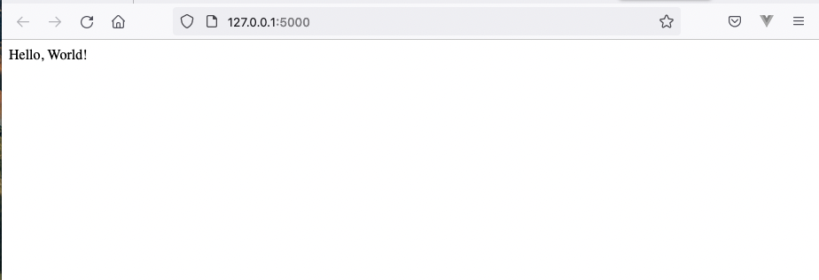

# REST API - Flask 

## Requirements 

Option 1 (recommended): With pipenv:
```
pipenv shell
pipenv install
```

Option 2: With pip:
```
pip install -r requirements
```


## First steps
### Install Flask
- Option 1: Using a virtual environment:
```shell
$ pipenv shell
$ pipenv install Flask
``` 
- Option 2: Directly in the system:
```shell
$ pip install -U Flask
``` 

### Create a minimal application

Inside the project directory, include the following code in a `.py` file. We call it `hello.py` in this example.

```python
from flask import Flask

app = Flask(__name__)

@app.route("/")
def hello_world():
    return "<p>Hello, World!</p>"

```
Test it:
```shell
$ flask --app hello run
* Serving Flask app 'hello'
* Debug mode: off
WARNING: This is a development server. Do not use it in a production deployment. Use a production WSGI server instead.
 * Running on http://127.0.0.1:5000
```

In your browser, go to [http://127.0.0.1:5000](http://127.0.0.1:5000): 



🎉  The app works! 


## Endppoints

### [GET, POST] /snippet
We only need one endpoint, to retrieve and push code snippets. 

