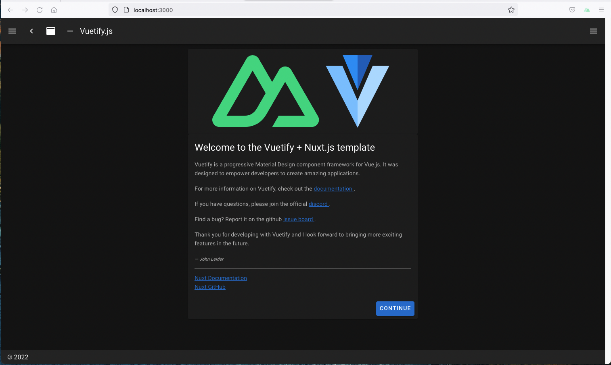

# Front-end app - Nuxt


## Create a nuxt app

Create a new nuxt project using the nuxt CLI. Enter in a terminal:

```bash$
$ npx create-nuxt-app nuxt-frontend

create-nuxt-app v5.0.0
✨  Generating Nuxt.js project in nuxt-frontend
? Project name: nuxt-frontend
? Programming language: JavaScript
? Package manager: Npm
? UI framework: Vuetify.js
? Template engine: HTML
? Nuxt.js modules: Axios - Promise based HTTP client
? Linting tools: Prettier
? Testing framework: None
? Rendering mode: Single Page App
? Deployment target: Static (Static/Jamstack hosting)
? Development tools: (Press <space> to select, <a> to toggle all, <i> to invert selection)
? Continuous integration: None
? Version control system: Git

...

🎉  Successfully created project nuxt-frontend

  To get started:

        cd nuxt-frontend
        npm run dev

  To build & start for production:

        cd nuxt-frontend
        npm run build
        npm run start
        
```
Check if the app starts as it should:

```
$ nuxt-frontend git:(master) ✗ npm run dev

> nuxt-frontend@1.0.0 dev /Users/evabsc/PyDayBCN2022/nuxt-frontend
> nuxt


   ╭───────────────────────────────────────╮
   │                                       │
   │   Nuxt @ v2.15.8                      │
   │                                       │
   │   ▸ Environment: development          │
   │   ▸ Rendering:   client-side          │
   │   ▸ Target:      static               │
   │                                       │
   │   Listening: http://localhost:3000/   │
   │                                       │
   ╰───────────────────────────────────────╯

```

In your browser,  go the URL  [http://localhost:3000/](http://127.0.0.1:3000): 



🎉  The app works!

## Requirements 
- vue-code-highlight
```
npm i vue-code-highlight
```

## Using the code in this repository 
```
cd nuxt-frontend 
npm install
```
